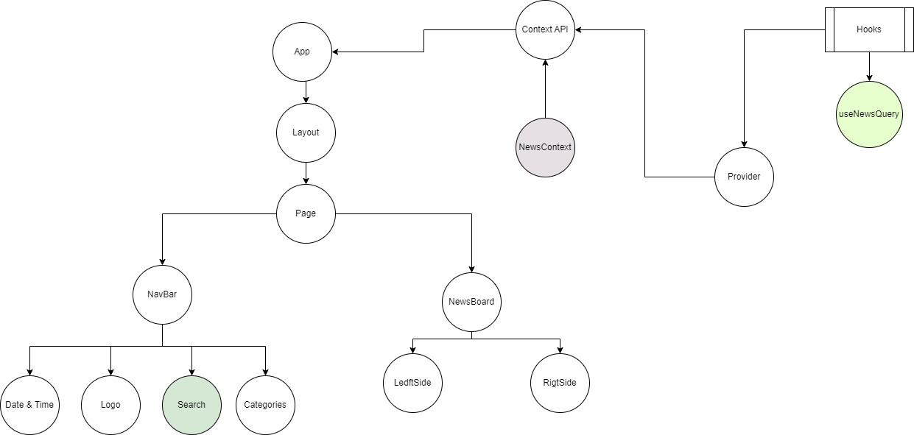

# News Feeder - Assignment 4

Welcome to the News Feeder project for Assignment 4.

## Description

This project is a news feed application developed as part of Assignment 4. It allows users to browse and read news articles from various sources.

## Features

- Browse latest news articles
- Search for specific news articles
- Customizable news categories

## Technologies Used

- React.js
- Tailwind CSS
- JavaScript

## Diagrams



## Getting Started

To get started with the project, follow these steps:

1. Clone the repository:

```bash
git clone https://github.com/Tanzimhossain222/News-Feeder.git
```

2. Navigate to the project directory:

```bash
cd News-Feeder
```

3. Install dependencies:

```bash
npm install
```

4. Start the development server:

```bash
npm start
```

5. Open your browser and visit `http://localhost:5173/` to view the application.

## Repository

You can find the project repository on GitHub: [News-Feeder](https://github.com/Tanzimhossain222/News-Feeder)

Feel free to contribute to the project by creating pull requests or raising issues.
